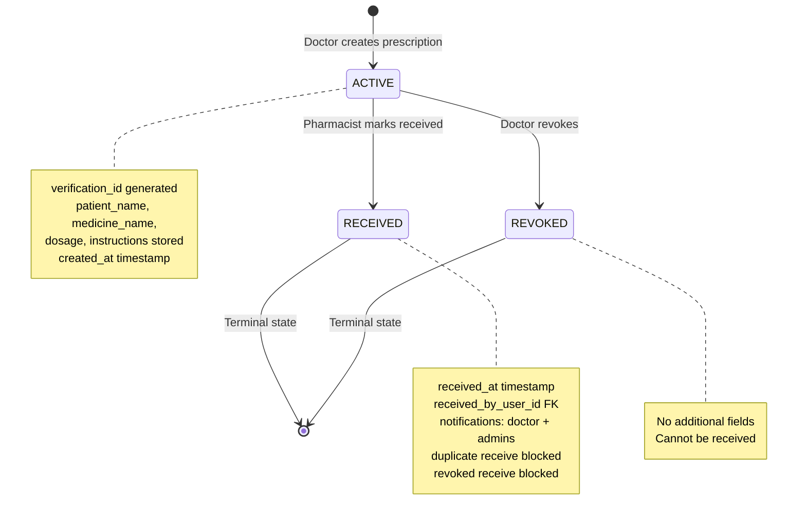
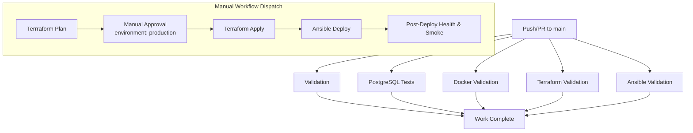
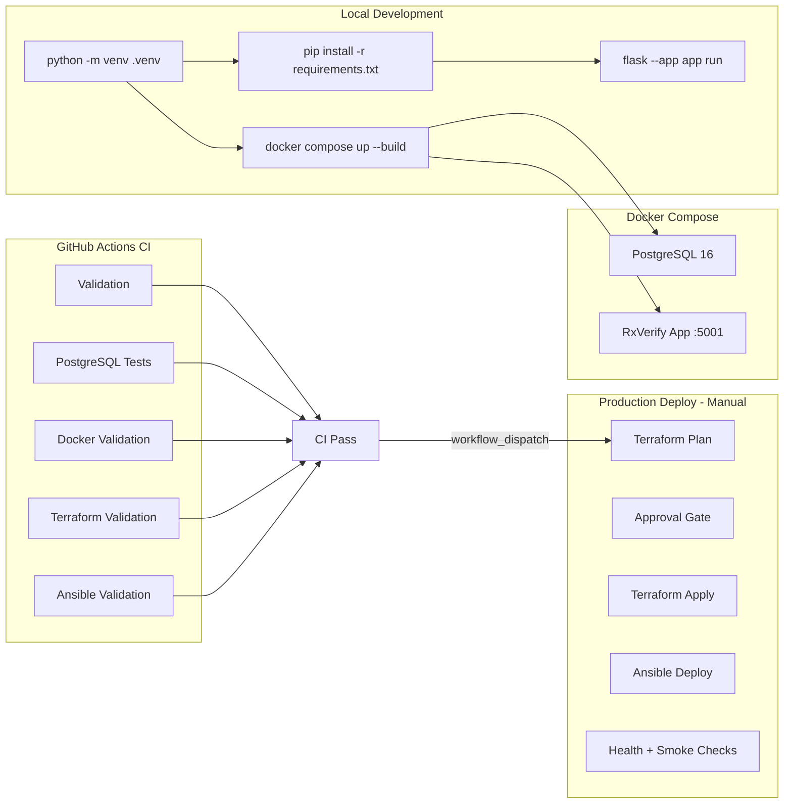

# RxVerify System Architecture

## 1. Project Overview

RxVerify is a digital prescription verification system implementing a secure handoff workflow from doctors to pharmacists. The system provides role-based portals for prescription creation, verification, and receipt, with an administrative dashboard for hospital hierarchy management.

**Key capabilities:**
- Doctor portal: Create prescriptions, view prescription history, receive notifications
- Pharmacist portal: Verify prescriptions, mark medicines as received
- Admin portal: Dashboard, hospital management, user oversight
- Dual-database support: SQLite (development/testing) and PostgreSQL (production/Docker)
- Full DevOps pipeline: Docker, Terraform, Ansible, GitHub Actions CI/CD

---

## 2. Application Architecture

### 2.1 Flask Application Factory

The application uses the **Flask Application Factory** pattern (`src/__init__.py:102`):

```python
def create_app(test_config: dict | None = None) -> Flask:
```

- Single `create_app()` entry point supports three configurations:
  - `DevelopmentConfig` → SQLite, debug enabled
  - `TestingConfig` → In-memory SQLite, test settings
  - `ProductionConfig` → PostgreSQL, requires `DATABASE_URL` and `SECRET_KEY`

- Templates and static files served from project root (`../templates`, `../static`)
- Database abstraction layer (`get_db()`) provides unified SQLite/PostgreSQL interface
- Blueprints registered for auth, doctor, pharmacist, admin modules

### 2.2 Blueprints and Routing

| Blueprint | URL Prefix | Role Required | Description |
|-----------|------------|---------------|-------------|
| `auth` | `/login/<role>`, `/logout` | None | Login/logout for doctor, pharmacist, admin |
| `doctor` | `/prescriptions/*`, `/notifications/*` | `doctor` | Prescription CRUD, notifications |
| `pharmacist` | `/verify*`, `/receive/*` | `pharmacist` + `doctor` (verification view) | Verification, receipt |
| `admin` | `/admin/*` | `admin` | Dashboard, hospitals, users |

### 2.3 Authentication & Session Management

- **Session-based authentication** using Flask's signed session cookie
- Login validates: user exists, role matches requested role, user is active, password hash matches
- Session stores: `name`, `role`, `user_id`
- Generic error message prevents email enumeration

### 2.4 Role-Based Access Control (RBAC)

Three roles implemented via decorators (`src/decorators.py`):

| Role | Permissions |
|------|-------------|
| `doctor` | Create prescriptions, view own records, receive notifications |
| `pharmacist` | Verify prescriptions, mark medicines received |
| `admin` | Full dashboard, hospital/user oversight |

Decorators used:
- `@require_role("doctor")` — single role enforcement
- `@require_any_role("doctor", "pharmacist")` — multiple roles
- `@require_admin()` — admin-only routes

### 2.5 Hospital Hierarchy

- `hospitals` table: `id`, `name` (unique), `address`, `phone`, `email`, `created_at`
- `users.hospital_id` FK → `hospitals.id` (nullable for admins)
- Doctors/pharmacists belong to exactly one hospital
- Admins have no hospital affiliation
- Admin dashboard shows hospital statistics and drill-down views

---

## 3. Prescription Lifecycle

### 3.1 Status States

```
ACTIVE → RECEIVED
ACTIVE → REVOKED
```

### 3.2 Transitions

| From State | To State | Trigger | Actor | Database Changes |
|------------|----------|---------|-------|------------------|
| ACTIVE | RECEIVED | Pharmacist clicks "Mark Medicine Received" | Pharmacist | `status='received'`, `received_at=NOW()`, `received_by_user_id=pharmacist_id` |
| ACTIVE | REVOKED | Doctor clicks "Revoke" | Doctor | `status='revoked'` |

### 3.3 Protection Rules

- **Duplicate receive protection**: Cannot RECEIVE already-received prescription
- **Revoked receive protection**: Cannot RECEIVE revoked prescription
- **Only ACTIVE prescriptions** can transition to RECEIVED
- Data preservation: all original fields retained; only status/timestamps change

### 3.4 Notifications on RECEIVE

When pharmacist marks RECEIVED:
1. Notification created for prescribing doctor (matched by `doctor_name` → user `name`+`role='doctor'`)
2. Notifications created for ALL active admins
2. Doctor sees unread count badge in navigation
5. Doctor can mark individual or all notifications as read

### 3.5 Mermaid Lifecycle Diagram



---

## 4. Database Abstraction Layer

### 4.1 Unified Interface (`src/__init__.py:24-100`)

Two wrapper classes provide identical interfaces:

| Class | Backend | Placeholder Style |
|-------|---------|-------------------|
| `SQLiteConnection` | `sqlite3` | `?` |
| `PSQLConnection` | `psycopg2` | `%s` (auto-converted from `?`) |

- `get_db()`: request-scoped connection stored in Flask `g`
- Automatic type detection from `DATABASE_URL` prefix
- `close_db()` teardown closes connection per request

### 4.2 Schema Initialization (`src/__init__.py:177-411`)

Idempotent `init_db()` creates tables if not exists:

1. **Users table** — roles `doctor`, `pharmacist`, `admin` (CHECK constraint)
2. **Hospitals table** — `name` UNIQUE constraint (migration-safe)
3. **Prescriptions table** — `verification_id` UNIQUE, default status `active`
4. **Notifications table** — FK to users + optional FK to prescriptions
5. **Migrations** (idempotent):
   - `users.hospital_id` FK → hospitals
   - `prescriptions.received_at`, `received_by_user_id` FK → users
   - `notifications` table (dual CREATE for safety)

---

## 5. Docker Containerization

### 5.1 Multi-Stage Dockerfile

| Stage | Base | Purpose |
|-------|------|---------|
| builder | `python:3.12-slim` | Install dependencies system-wide |
| final | `python:3.12-slim` | Copy deps, create non-root `appuser`, run Gunicorn |

**Security hardening:**
- Non-root user (`appuser`)
- `HEALTHCHECK` against `/health` endpoint
- `PYTHONDONTWRITEBYTECODE=1`, `PYTHONUNBUFFERED=1`

### 5.2 docker-compose.yml (Local Development)

```yaml
services:
  postgres:      # PostgreSQL 16-alpine
    ports:       # 5433:5432 (host:container)
    volumes:     # postgres_data persisted
    healthcheck: # pg_isready

  rxverify:      # Built from local Dockerfile
    ports:       # 5001:5000 (avoids macOS port 5000 conflict)
    env:         # DATABASE_URL → postgresql://postgres@postgres:5432/rxverify
    volumes:     # prescription_data → /app/instance
    depends_on:  # postgres condition: service_healthy
```

---

## 6. Terraform Infrastructure (AWS)

### 6.1 Resources Created

| Resource | Purpose |
|----------|---------|
| `aws_vpc` | 10.10.0.0/16 with DNS hostname/support |
| `aws_internet_gateway` | Public internet access |
| `aws_subnet` | 10.10.1.0/24, auto-assign public IP |
| `aws_route_table` + `aws_route` | 0.0.0.0/0 → IGW |
| `aws_route_table_association` | Subnet ↔ route table |
| `aws_security_group` | SSH (restricted CIDR) + HTTP (0.0.0.0/0) |
| `aws_instance` | Ubuntu 24.04, t3.micro, gp3 8GB |

### 6.2 Variables (Security-Critical)

| Variable | Default | Notes |
|----------|---------|-------|
| `aws_region` | `ap-south-1` | |
| `aws_profile` | `fa1` | CLI profile |
| `key_name` | `fa1-key` | Existing EC2 key pair |
| `instance_type` | `t3.micro` | Free-tier eligible |
| **`allowed_ssh_cidr`** | **`0.0.0.0/0`** | **MUST override for production!** |

### 6.3 Outputs

- `instance_public_ip` — Target for Ansible inventory
- `instance_public_dns` — DNS name
- `website_url` — `http://<public_ip>`

---

## 7. Ansible Deployment

### 7.1 deploy.yml Playbook Flow

1. **Assertions** — Verify `app_secret_key` (≥32 chars) and `postgres_password` (≥16 chars, not defaults)
2. **Package update** — `apt update_cache`
3. **Docker install** — `docker.io` + `python3-docker`
4. **Docker service** — Start/enable
5. **File copy** — Application files → `/opt/rxverify`
6. **Docker image build** — `docker build -t rxverify:latest .`
7. **Docker network** — `rxverify-network`
8. **Docker volumes** — `rxverify_postgres_data`, `rxverify_data`
9. **PostgreSQL container** — `postgres:16-alpine`, healthcheck, no_log
10. **Wait for PostgreSQL** — `pg_isready` retries
11. **RxVerify container** — Port 80:5000, env from secrets, healthcheck
12. **Health verification** — `curl http://127.0.0.1/health` retries

### 7.2 Terraform → Ansible Integration

```
Terraform apply
      ↓
terraform output -raw instance_public_ip
      ↓
ansible/generate_inventory.py --tf-output-dir ../terraform
      ↓
inventory.ini (SSH host, user=ubuntu, key file)
      ↓
ansible-playbook -i inventory.ini deploy.yml
```

### 7.3 Secret Handling

- `ansible/secrets.yml` — **Gitignored**, contains:
  - `app_secret_key` (generate: `openssl rand -hex 32`)
  - `postgres_password` (generate: `openssl rand -hex 16`)
- Playbook assertions **fail fast** if defaults detected

---

## 8. GitHub Actions CI/CD

### 8.1 Pipeline Overview



### 8.2 CI Jobs (Automatic on push/PR)

| Job | Validates |
|-----|-----------|
| `validation` | Python imports, dependencies |
| `postgresql-tests` | Full test suite against live PostgreSQL 16 |
| `docker-validation` | `docker compose config`, build, up, health, smoke |
| `terraform-validation` | `fmt -check`, `init -backend=false`, `validate` |
| `ansible-validation` | Syntax check, config dump |

### 8.3 CD Jobs (Manual workflow_dispatch only)

| Job | Trigger | Notes |
|-----|---------|-------|
| `terraform-plan` | Manual + CI pass | Uploads plan artifact |
| `terraform-apply` | Manual approval (environment: production) | Requires AWS credentials secrets |
| `ansible-deploy` | After apply | Uses Terraform outputs + SSH key secret |

---

## 9. Deployment Flow Summary



---

## 10. Security Boundaries

| Layer | Control |
|-------|---------|
| **Application** | Parameterized queries (`?` placeholders), Werkzeug password hashing, RBAC decorators, session authentication |
| **Database** | Schema-level FK constraints, CHECK constraints, UNIQUE constraints, idempotent migrations |
| **Container** | Non-root user, healthcheck, read-only filesystem (via copy), no secrets in image |
| **Network (Docker)** | Isolated `rxverify-network`, no exposed DB port |
| **Network (AWS)** | Security group: SSH restricted to `allowed_ssh_cidr`, HTTP open |
| **Secrets** | `.env` ignored, `secrets.yml` ignored, GitHub Actions secrets for AWS/SSH |
| **CI/CD** | Least-privilege permissions (`contents: read`, `id-token: write`), manual approval gate |

---

## 11. Component Status Summary

| Component | Status | Evidence |
|-----------|--------|----------|
| Flask App (SQLite) | **VALIDATED** | Tests pass, runs locally |
| Flask App (PostgreSQL) | **VALIDATED** | CI PostgreSQL tests pass |
| Admin + Hospital hierarchy | **VALIDATED** | Tests cover all admin routes |
| RECEIVED lifecycle | **VALIDATED** | Tests cover receive, notifications, protections |
| Docker Compose | **VALIDATED** | `docker compose up --build` healthy |
| Dockerfile | **VALIDATED** | CI build + healthcheck pass |
| Terraform config | **VALIDATED** | CI `fmt/validate` pass |
| Ansible playbook | **VALIDATED** | CI syntax check pass |
| CI Pipeline | **VALIDATED** | Runs on push/PR |
| CD Pipeline | **CONFIGURED** | Manual dispatch, approval gated |
| **AWS Live Deployment** | **NOT EXECUTED** | Terraform apply + Ansible not run in current verification |

---

*Last updated: 2026-08-21 — Reflects Tasks 1–9 implementation*
