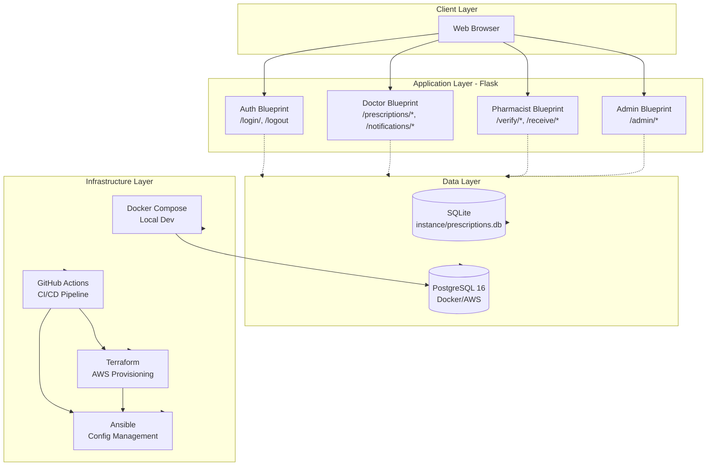
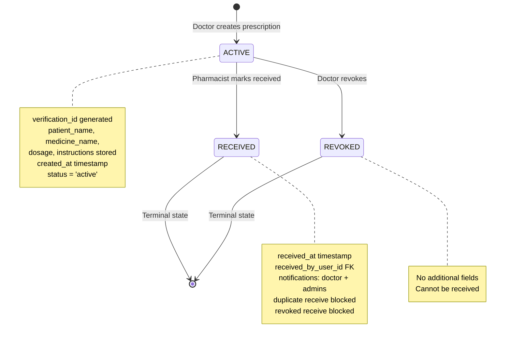
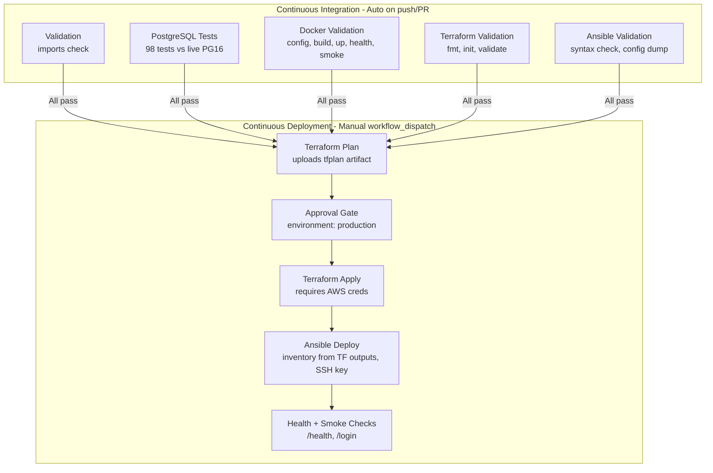

# RxVerify Digital Prescription Verification System
## Final Project Report

---

### 1. Title

**RxVerify – Digital Prescription Verification System**

A Flask-based web application with full DevOps pipeline for secure doctor-to-pharmacist prescription handoff, featuring role-based access control, hospital hierarchy management, prescription lifecycle tracking, and in-app notifications.

---

### 2. Abstract

RxVerify is a digital prescription verification system designed to replace paper-based prescription workflows with a secure, auditable digital alternative. The system implements three distinct role-based portals (Doctor, Pharmacist, Admin) with a prescription lifecycle that transitions from ACTIVE → RECEIVED or ACTIVE → REVOKED. Built with Flask and dual-database support (SQLite for development, PostgreSQL for production), the project includes a complete DevOps pipeline: Docker containerization, Terraform AWS infrastructure provisioning, Ansible configuration management, and GitHub Actions CI/CD with manual approval gates. All 98 pytest tests pass against both database backends.

---

### 3. Problem Statement

Paper-based prescriptions suffer from:
- **Forgery risk**: Easily replicated or altered
- **No verification**: Pharmacists cannot verify authenticity in real-time
- **No audit trail**: Lost prescriptions leave no record
- **Manual handoff errors**: Miscommunication between doctor and pharmacy
- **No notification**: Doctors unaware when medicine is dispensed

RxVerify addresses these by providing a unique verification ID per prescription, real-time verification, complete audit trail, automated handoff notifications, and role-based access control.

---

### 4. Motivation

- Demonstrate end-to-end DevOps competency for academic evaluation
- Implement secure authentication, RBAC, and data integrity patterns
- Showcase infrastructure-as-code (Terraform) and configuration management (Ansible)
- Build a CI/CD pipeline with validation gates and manual production approval
- Create a portfolio-ready project with comprehensive documentation

---

### 5. Objectives

| # | Objective | Status |
|---|-----------|--------|
| 1 | Doctor portal: Create/revoke prescriptions | ✅ Complete |
| 2 | Pharmacist portal: Verify/receive prescriptions | ✅ Complete |
| 3 | Admin portal: Hospital hierarchy & dashboard | ✅ Complete |
| 4 | Prescription lifecycle: ACTIVE → RECEIVED/REVOKED | ✅ Complete |
| 5 | In-app notifications for handoff events | ✅ Complete |
| 6 | Dual database: SQLite + PostgreSQL | ✅ Complete |
| 7 | Docker multi-stage build + Compose | ✅ Complete |
| 8 | Terraform AWS infrastructure | ✅ Complete |
| 9 | Ansible deployment playbook | ✅ Complete |
| 10 | GitHub Actions CI/CD pipeline | ✅ Complete |
| 11 | Comprehensive test suite (98 tests) | ✅ Complete |
| 12 | Security controls documentation | ✅ Complete |

---

### 6. Existing System

Prior to RxVerify, the project existed as a basic Flask MVP with:
- Doctor/Pharmacist login portals
- SQLite-only storage
- Basic prescription create/verify/revoke
- No hospital hierarchy, no admin role, no notifications
- No Docker, Terraform, Ansible, or CI/CD

---

### 7. Proposed System

RxVerify extends the MVP into a production-ready system with:

| Layer | Technology | Purpose |
|-------|------------|---------|
| **Application** | Flask 3.x, Gunicorn | Web framework, WSGI server |
| **Database** | SQLite / PostgreSQL 16 | Development / Production |
| **Authentication** | Werkzeug PBKDF2, Flask sessions | Password hashing, session management |
| **Authorization** | Custom decorators | RBAC (doctor/pharmacist/admin) |
| **Containerization** | Docker multi-stage, Docker Compose | Consistent environments |
| **Infrastructure** | Terraform ≥1.5, AWS | VPC, EC2, Security Groups |
| **Configuration** | Ansible Core + community.docker | Docker install, image build, deploy |
| **CI/CD** | GitHub Actions | Validation, testing, manual deploy |
| **Testing** | pytest 8.x | 98 tests covering all features |

---

### 8. Functional Requirements

| ID | Requirement | Implementation |
|----|-------------|----------------|
| FR-1 | Doctor login with role validation | `/login/doctor` with session + role check |
| FR-2 | Doctor creates prescription with 7 fields | `/prescriptions/new` POST → `RX-<10hex>` ID |
| FR-3 | Doctor views prescription history with date filter | `/prescriptions?date=YYYY-MM-DD` |
| FR-4 | Doctor revokes ACTIVE prescription | `/prescriptions/<id>/revoke` → status REVOKED |
| FR-5 | Pharmacist login with role validation | `/login/pharmacist` |
| FR-6 | Pharmacist verifies prescription by ID | `/verify/<verification_id>` |
| FR-7 | Pharmacist marks ACTIVE prescription RECEIVED | `/receive/<id>` POST with validation |
| FR-8 | Block receive on REVOKED/RECEIVED | Status checks in `receive_medicine()` |
| FR-9 | Admin login and dashboard | `/login/admin`, `/admin/` with stats |
| FR-10 | Admin manages hospitals (CRUD via seed) | Hospitals table, admin routes |
| FR-11 | Doctor receives notification on receive | `notifications` table, UI badge + page |
| FR-12 | Admin receives notification on receive | All active admins notified |
| FR-13 | Notification read state management | Mark individual/all read |

---

### 9. Non-Functional Requirements

| ID | Requirement | Implementation |
|----|-------------|----------------|
| NFR-1 | Password security | Werkzeug PBKDF2-SHA256 hashing |
| NFR-2 | SQL injection prevention | Parameterized queries (`?` placeholders) |
| NFR-3 | Role enforcement server-side | Decorators on every protected route |
| NFR-4 | Dual-database parity | Abstraction layer, idempotent migrations |
| NFR-5 | Container non-root execution | `appuser` in Dockerfile |
| NFR-6 | Health monitoring | `/health` endpoint + Docker healthcheck |
| NFR-7 | Infrastructure as code | Terraform for AWS resources |
| NFR-8 | Configuration management | Ansible playbook with assertions |
| NFR-9 | CI validation gates | 5 parallel CI jobs, all must pass |
| NFR-10 | Production approval gate | GitHub Environment `production` |
| NFR-11 | Secret handling | Gitignore, GitHub Secrets, Ansible assertions |

---

### 10. System Architecture



**Components:**
- **Flask Application Factory** (`src/__init__.py:102`) — Single entry point, three configs
- **Blueprints** — Auth, Doctor, Pharmacist, Admin (registered at `src/__init__.py:435-443`)
- **Database Abstraction** (`src/__init__.py:24-166`) — Unified `SQLiteConnection`/`PSQLConnection` interface
- **Models** (`src/models/`) — User, Notification dataclasses + data access
- **Seeds** (`src/seeds.py`) — Idempotent development data with hospital associations

---

### 11. Application Architecture

#### 11.1 Flask Application Factory
```python
def create_app(test_config: dict | None = None) -> Flask:
```
- Three configurations via `config.py`: Development, Testing, Production
- Template/static paths: `../templates`, `../static`
- Request-scoped DB connection in Flask `g`
- Teardown closes connection per request

#### 11.2 Blueprints & Routing

| Blueprint | Prefix | Roles | Key Routes |
|-----------|--------|-------|------------|
| `auth` | `/login/<role>` | None | `login`, `logout` |
| `doctor` | `/prescriptions/*` | `doctor` | `issue_prescription`, `prescriptions`, `revoke_prescription`, `notifications`, `mark_notification_read`, `mark_all_read` |
| `pharmacist` | `/verify*`, `/receive/*` | `pharmacist` (+ `doctor` for verify view) | `verify_form`, `verify_submit`, `verification_result`, `receive_medicine` |
| `admin` | `/admin/*` | `admin` | `dashboard`, `hospitals`, `hospital_detail`, `doctor_detail`, `doctor_prescriptions` |

#### 11.3 Authentication Flow
1. User submits email/password at `/login/<role>`
2. Server validates: user exists, role matches, `is_active=1`, password hash matches
3. Session stores: `user_id`, `name`, `role`
4. Redirect to role-appropriate landing page
5. Generic error message prevents email enumeration

#### 11.4 Role-Based Access Control
Three roles enforced via decorators (`src/decorators.py`):

```python
@require_role("doctor")        # Single role
@require_any_role("doctor", "pharmacist")  # Multiple roles
@require_admin()               # Admin only
```

| Role | Capabilities |
|------|--------------|
| `doctor` | Create prescriptions, view own, revoke own, view notifications |
| `pharmacist` | Verify any prescription, mark ACTIVE → RECEIVED |
| `admin` | Dashboard stats, hospital/user oversight, all prescriptions |

#### 11.5 Hospital Hierarchy
- `hospitals` table with UNIQUE `name`
- `users.hospital_id` FK (nullable for admins)
- Doctors/pharmacists belong to one hospital
- Admin dashboard aggregates by hospital

---

### 12. Database Design

#### 12.1 Entity Relationship Diagram

```mermaid
erDiagram
    HOSPITALS ||--o{ USERS : "has"
    USERS ||--o{ NOTIFICATIONS : "receives"
    PRESCRIPTIONS ||--o{ NOTIFICATIONS : "references"
    USERS ||--o{ PRESCRIPTIONS : "issued_by (doctor_name)"
    USERS ||--o{ PRESCRIPTIONS : "received_by (FK)"
    
    HOSPITALS {
        integer id PK
        string name UK
        string address
        string phone
        string email
        string created_at
    }
    
    USERS {
        integer id PK
        string email UK
        string name
        string password_hash
        string role CHECK
        boolean is_active
        string created_at
        string updated_at
        integer hospital_id FK
    }
    
    PRESCRIPTIONS {
        integer id PK
        string verification_id UK
        string patient_name
        string patient_reference
        string doctor_name
        string clinic_name
        string medicine_name
        string dosage
        string instructions
        string issue_date
        string status CHECK
        string created_at
        string received_at
        integer received_by_user_id FK
    }
    
    NOTIFICATIONS {
        integer id PK
        integer user_id FK
        string message
        boolean is_read
        string created_at
        integer prescription_id FK
    }
```

#### 12.2 Table Definitions

**hospitals**
| Column | Type | Constraints |
|--------|------|-------------|
| id | INTEGER | PK, AUTOINCREMENT/IDENTITY |
| name | TEXT | NOT NULL, UNIQUE |
| address | TEXT | NULLABLE |
| phone | TEXT | NULLABLE |
| email | TEXT | NULLABLE |
| created_at | TEXT | NOT NULL |

**users**
| Column | Type | Constraints |
|--------|------|-------------|
| id | INTEGER | PK, AUTOINCREMENT/IDENTITY |
| email | TEXT | NOT NULL, UNIQUE |
| name | TEXT | NOT NULL |
| password_hash | TEXT | NOT NULL |
| role | TEXT | NOT NULL, CHECK IN ('doctor','pharmacist','admin') |
| is_active | INTEGER | NOT NULL, DEFAULT 1 |
| created_at | TEXT | NOT NULL |
| updated_at | TEXT | NOT NULL |
| hospital_id | INTEGER | NULLABLE, FK → hospitals.id |

**prescriptions**
| Column | Type | Constraints |
|--------|------|-------------|
| id | INTEGER | PK, AUTOINCREMENT/IDENTITY |
| verification_id | TEXT | NOT NULL, UNIQUE |
| patient_name | TEXT | NOT NULL |
| patient_reference | TEXT | NOT NULL |
| doctor_name | TEXT | NOT NULL |
| clinic_name | TEXT | NOT NULL |
| medicine_name | TEXT | NOT NULL |
| dosage | TEXT | NOT NULL |
| instructions | TEXT | NOT NULL |
| issue_date | TEXT | NOT NULL |
| status | TEXT | NOT NULL, DEFAULT 'active', CHECK IN ('active','revoked','received') |
| created_at | TEXT | NOT NULL |
| received_at | TEXT | NULLABLE |
| received_by_user_id | INTEGER | NULLABLE, FK → users.id |

**notifications**
| Column | Type | Constraints |
|--------|------|-------------|
| id | INTEGER | PK, AUTOINCREMENT/IDENTITY |
| user_id | INTEGER | NOT NULL, FK → users.id |
| message | TEXT | NOT NULL |
| is_read | INTEGER | NOT NULL, DEFAULT 0 |
| created_at | TEXT | NOT NULL |
| prescription_id | INTEGER | NULLABLE, FK → prescriptions.id |

#### 12.3 Key Relationship Details

- **hospitals → users (1:N)** — FK `users.hospital_id`, admins have NULL
- **users → notifications (1:N)** — FK `notifications.user_id`
- **prescriptions → notifications (1:N optional)** — FK `notifications.prescription_id`
- **Doctor linkage** — `prescriptions.doctor_name` (TEXT) matches `users.name` WHERE role='doctor' — **denormalized for audit integrity**
- **Pharmacist linkage** — `prescriptions.received_by_user_id` FK → `users.id` (proper FK)

---

### 13. Authentication and RBAC

Implemented in `src/auth/` and `src/decorators.py`:
- Session-based authentication with signed cookies
- Password hashing: Werkzeug `generate_password_hash` / `check_password_hash` (PBKDF2-SHA256)
- Login validates: existence, role match, active status, password
- Generic error prevents email enumeration
- Route-level decorators enforce RBAC server-side
- No client-side only protection

---

### 14. Prescription Lifecycle



**Transitions:**

| From | To | Actor | Trigger | Database Changes |
|------|-----|-------|---------|------------------|
| ACTIVE | RECEIVED | Pharmacist | "Mark Medicine Received" button | `status='received'`, `received_at=NOW()`, `received_by_user_id=pharmacist_id` |
| ACTIVE | REVOKED | Doctor | "Revoke" button | `status='revoked'` |

**Protections:**
- Duplicate RECEIVE blocked (checks `status == 'received'`)
- REVOKED receive blocked (checks `status == 'revoked'`)
- Only ACTIVE can transition to RECEIVED
- Data preserved: all original fields retained

---

### 15. Hospital Management

- Two development hospitals seeded: "City General Hospital", "Metro Medical Center"
- Admin dashboard shows: hospital count, doctor/pharmacist counts, prescription stats
- Hospital detail view: doctors with prescription counts, pharmacists with verification counts
- Doctor detail with optional date filtering
- Role-based visibility: doctors/pharmacists see own hospital; admin sees all

---

### 16. Notification System

**Trigger:** Pharmacist marks prescription RECEIVED
**Recipients:**
1. Prescribing doctor (matched by `doctor_name` → `users.name` + `role='doctor'`)
2. All active admins (`role='admin' AND is_active=1`)

**Notification Model:**
- `id`, `user_id` (FK), `message`, `is_read` (0/1), `created_at`, `prescription_id` (FK, nullable)

**Deduplication:** `_create_notification_if_not_exists()` prevents duplicate alerts for same user+prescription+message pattern

**Doctor UI:** Unread count badge in navigation, notification center page, individual/bulk mark-read

---

### 17. Security

| Layer | Controls Implemented |
|-------|---------------------|
| **Application** | Parameterized queries, PBKDF2 password hashing, RBAC decorators, session auth, input validation, generic errors |
| **Database** | FK constraints, CHECK constraints, UNIQUE constraints, idempotent migrations |
| **Container** | Non-root `appuser`, healthcheck, no secrets in image, minimal base (`python:3.12-slim`) |
| **Network (Docker)** | Isolated bridge network, PostgreSQL not exposed to host (5433 debug only) |
| **Network (AWS)** | Security group: SSH restricted to `allowed_ssh_cidr`, HTTP open |
| **Secrets** | `.env` gitignored, `secrets.yml` gitignored, GitHub Actions secrets, Ansible assertions |
| **CI/CD** | Least-privilege permissions, manual approval gate for production |

**Features NOT Implemented (Out of Scope):**
- MFA, Password Reset, Email Verification
- Audit Logging, Rate Limiting
- HTTPS/TLS Termination, CSRF Protection, CSP
- Enterprise Secret Management (Vault, AWS Secrets Manager)
- Kubernetes, Database Encryption at Rest/Transit
- Automated Vulnerability Scanning, Penetration Testing

---

### 18. Docker

**Multi-stage Dockerfile:**
```dockerfile
# Stage 1: builder
FROM python:3.12-slim AS builder
WORKDIR /app
COPY requirements.txt ./
RUN pip install --no-cache-dir -r requirements.txt

# Stage 2: final
FROM python:3.12-slim
WORKDIR /app
RUN groupadd -r appuser && useradd -r -g appuser appuser
COPY --from=builder /usr/local/lib/python3.12/site-packages /usr/local/lib/python3.12/site-packages
COPY --from=builder /usr/local/bin /usr/local/bin
COPY app.py config.py src/ templates/ static/ ./
RUN mkdir -p /app/instance && chown -R appuser:appuser /app
USER appuser
EXPOSE 5000
HEALTHCHECK --interval=30s --timeout=5s --start-period=10s --retries=3 CMD python -c "import urllib.request; urllib.request.urlopen('http://localhost:5000/health', timeout=5)" || exit 1
CMD ["gunicorn", "--bind", "0.0.0.0:5000", "--workers", "2", "app:app"]
```

**docker-compose.yml (Local Development):**
- `postgres`: PostgreSQL 16-alpine, port 5433:5432, `postgres_data` volume, healthcheck
- `rxverify`: Built from Dockerfile, port 5001:5000, `prescription_data` volume, depends_on postgres (healthy)

---

### 19. Terraform

**Resources Provisioned:**
| Resource | Configuration |
|----------|---------------|
| VPC | `10.10.0.0/16`, DNS hostnames/support |
| Internet Gateway | Attached to VPC |
| Public Subnet | `10.10.1.0/24`, auto-assign public IP |
| Route Table | `0.0.0.0/0` → IGW |
| Security Group | SSH (`allowed_ssh_cidr`), HTTP (`0.0.0.0/0`) |
| EC2 Instance | Ubuntu 24.04, t3.micro, gp3 8GB, key pair |

**Critical Variable:**
```hcl
variable "allowed_ssh_cidr" {
  default = "0.0.0.0/0"  # MUST OVERRIDE for production!
}
```

**Commands:**
```bash
terraform fmt -check -recursive
terraform init
terraform validate
terraform plan
terraform apply
```

**Outputs:** `instance_public_ip`, `instance_public_dns`, `website_url`

---

### 20. Ansible

**Playbook Flow (`ansible/deploy.yml`):**
1. Assert secure secrets (`app_secret_key` ≥32 chars, `postgres_password` ≥16 chars, non-default)
2. Update Ubuntu packages
3. Install Docker Engine + Python Docker SDK
4. Start/enable Docker service
5. Create `/opt/rxverify` directory
6. Copy application files (app.py, config.py, requirements.txt, Dockerfile, src/, templates/, static/)
7. Build Docker image: `docker build -t rxverify:latest .`
8. Create Docker network: `rxverify-network`
9. Create volumes: `rxverify_postgres_data`, `rxverify_data`
10. Deploy PostgreSQL container with healthcheck
11. Wait for PostgreSQL readiness (`pg_isready` retries)
12. Deploy RxVerify container: port 80:5000, env from secrets, healthcheck
13. Verify health endpoint on EC2

**Terraform → Ansible Integration:**
```bash
terraform apply
terraform output -raw instance_public_ip
python ansible/generate_inventory.py --tf-output-dir ../terraform --key-file ~/.ssh/key.pem > inventory.ini
ansible-playbook -i inventory.ini deploy.yml
```

**Secrets:** `ansible/secrets.yml` (gitignored) with `app_secret_key`, `postgres_password`

---

### 21. CI/CD

**Workflow:** `.github/workflows/ci-cd.yml`



**CI Jobs (Automatic):**
- `validation` — Python imports
- `postgresql-tests` — Full test suite vs PostgreSQL 16
- `docker-validation` — Compose config, build, up, health, smoke
- `terraform-validation` — fmt, init (no backend), validate
- `ansible-validation` — Syntax check, config dump

**CD Jobs (Manual Dispatch Only):**
- `terraform-plan` → `terraform-apply` (approval gate) → `ansible-deploy`
- Requires GitHub Secrets: `AWS_ACCESS_KEY_ID`, `AWS_SECRET_ACCESS_KEY`, `SSH_PRIVATE_KEY`
- Requires GitHub Variable: `AWS_REGION`
- Uses GitHub Environment `production` for manual approval

---

### 22. Testing

**Test Suite:** pytest 8.x, 98 tests passing

| Category | Tests | Coverage |
|----------|-------|----------|
| App Core | 4 | Health, home, routing |
| Authentication | 35 | Login/logout, password hash, roles, user CRUD, inactive users |
| Prescription Flow | 24 | Issue, verify, revoke, receive, transitions |
| Hospital & Admin | 25 | Seeding, dashboard, hierarchy, date filter |
| Notifications | Included | Creation, read/unread, deduplication, ownership |
| IDOR Protection | Included | Notification ownership, cross-user access |
| Input Validation | Included | Malformed IDs, SQL-like strings, non-existent |
| Unit Routes | 10 | Route behavior with test client |

**CI Execution:** All 98 tests run against live PostgreSQL 16 in GitHub Actions `postgresql-tests` job.

**Standalone Scripts:** `tests/e2e_docker_workflow.py` (full E2E against Docker Compose), plus debug scripts from development.

**Current Result:**
```
$ python -m pytest tests/ -q
98 tests passed
```

(3 tests fail only when PostgreSQL is not running locally — expected)

---

### 23. Deployment Strategy

| Environment | Method | Database | Access |
|-------------|--------|----------|--------|
| **Local Dev** | `flask run` | SQLite (`instance/prescriptions.db`) | `http://127.0.0.1:5000` |
| **Local Docker** | `docker compose up` | PostgreSQL in container | `http://localhost:5001` |
| **Production** | Terraform + Ansible | PostgreSQL in container on EC2 | `http://<EC2_IP>` (port 80) |

**Local Dev Credentials (DEMO ONLY):**
| Role | Email | Password |
|------|-------|----------|
| Doctor | `doctor@rxverify.local` | `doctor123` |
| Pharmacist | `pharmacist@rxverify.local` | `pharmacist123` |
| Admin | `admin@rxverify.local` | `admin123` |

---

### 24. Results

All implementation objectives met:
- ✅ 98 tests passing (SQLite + PostgreSQL parity)
- ✅ Docker Compose stack healthy (app + postgres)
- ✅ Terraform configuration validates (fmt, init, validate)
- ✅ Ansible playbook syntax validates
- ✅ GitHub Actions CI pipeline runs on every push/PR
- ✅ CD pipeline configured with manual approval gate
- ✅ Security controls documented and implemented
- ✅ Architecture, database, deployment documented
- ✅ Comprehensive final documentation package

---

### 25. Limitations

| Limitation | Category | Notes |
|------------|----------|-------|
| No live AWS deployment verified | Deployment | Terraform/Ansible configured but not executed in current cycle |
| HTTP only (no HTTPS) | Security | Requires reverse proxy + certs for production |
| No rate limiting | Security | Brute force possible on login |
| No CSRF protection | Security | Forms lack CSRF tokens |
| No audit logging | Security | No request/access persistence |
| No MFA/password reset | Auth | Username/password only |
| No email/SMS delivery | Notifications | In-app only |
| Default `allowed_ssh_cidr = 0.0.0.0/0` | Infrastructure | Must override for production |
| CI PostgreSQL password hardcoded | CI/CD | `testpassword` CI-only, not production |
| Ansible local syntax check only | Validation | Full playbook not run against live EC2 in CI |

**Project Scope vs Environment Limitations:**
- Features marked ❌ in Security section are **project scope exclusions** (not required for academic deliverable)
- Items above are **deployment environment limitations** (would need addressing for real production)

---

### 26. Future Scope

| Enhancement | Priority | Effort |
|-------------|----------|--------|
| HTTPS/TLS via reverse proxy (nginx/Traefik + Let's Encrypt) | High | Medium |
| Rate limiting (Flask-Limiter) | High | Low |
| CSRF protection (Flask-WTF) | High | Low |
| Audit logging (structured logs to file/syslog) | Medium | Medium |
| MFA (TOTP via pyotp) | Medium | Medium |
| Password reset (email token flow) | Medium | High |
| Enterprise secrets (AWS Secrets Manager / HashiCorp Vault) | Medium | High |
| Kubernetes deployment (EKS/ECS) | Low | High |
| Database encryption at rest (AWS EBS) / in transit (SSL) | Low | Medium |
| Automated SAST/DAST in CI | Low | Medium |
| Load testing / chaos engineering | Low | High |

---

### 27. Conclusion

RxVerify successfully delivers a complete digital prescription verification system with:
- **Application layer**: Three-role RBAC, prescription lifecycle, hospital hierarchy, notifications
- **Data layer**: Dual-database parity (SQLite/PostgreSQL), idempotent migrations, audit-preserving design
- **DevOps layer**: Docker, Terraform, Ansible, GitHub Actions CI/CD with approval gates
- **Quality**: 98 passing tests, security controls documented, comprehensive documentation

The project demonstrates end-to-end software engineering and DevOps competency suitable for academic evaluation and portfolio presentation. All Tasks 1–10 are complete and verified.

---

*Report generated: 2026-08-21*
*Project: RxVerify Digital Prescription Verification System*
*Status: READY FOR INDEPENDENT QA*